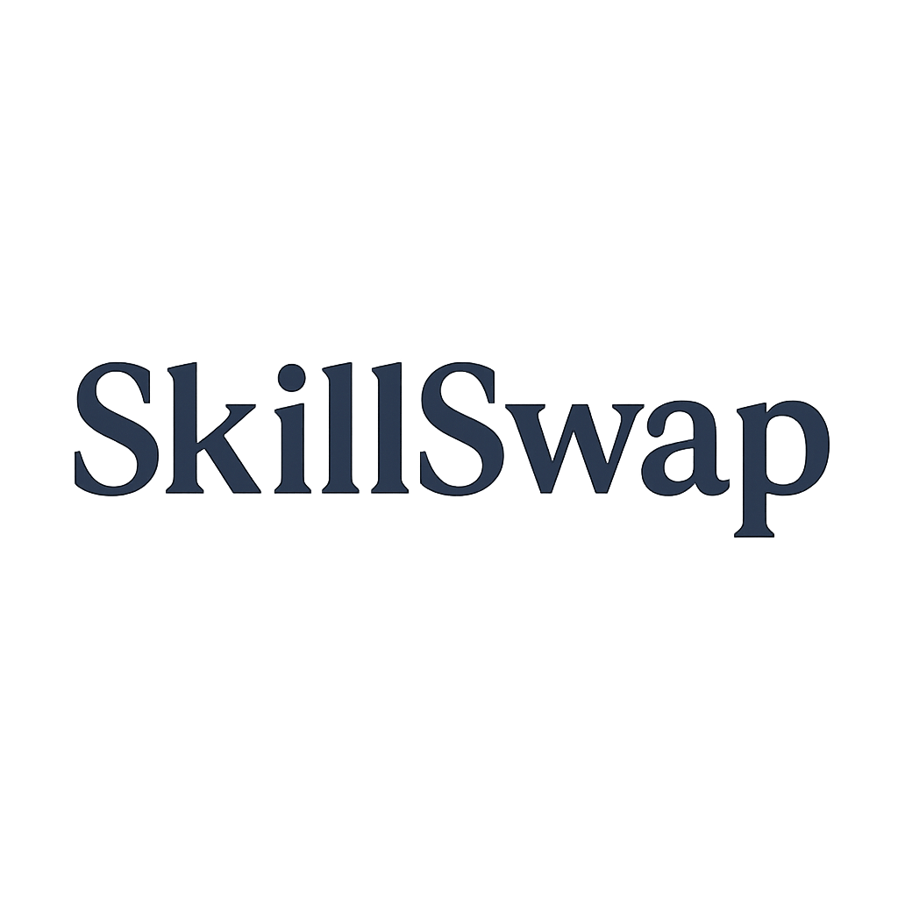

<div align="center">

  
   
<h2>
    <p>Check out the website at</p>
    <a href="https://github.com/Louis3797/awesome-readme-template">https://skillswap-frontend-gn9c.onrender.com</a>
    <p>Unfortunately the server spins down due to inactivity. It could take up to a minute for the application to load.</p>
    <a href="https://youtube.com">Or watch the demo</a>
  </h2>
</div>

<br />

<!-- Table of Contents -->
# Table of Contents

- [About the Project](#star2-about-the-project)
  * [Screenshots](#camera-screenshots)
  * [Tech Stack](#space_invader-tech-stack)
  * [Features](#dart-features)
  * [Color Reference](#art-color-reference)
  * [Environment Variables](#key-environment-variables)
- [Getting Started](#toolbox-getting-started)
  * [Prerequisites](#bangbang-prerequisites)
  * [Installation](#gear-installation)
  * [Running Tests](#test_tube-running-tests)
  * [Run Locally](#running-run-locally)
  * [Deployment](#triangular_flag_on_post-deployment)
- [Usage](#eyes-usage)
- [Contributors](#wave-contributing)

  

<!-- About the Project -->
## About the Project

<h4>
SkillSwap is a platform that enables users to share skills and teach each other about every topic imaginable. The focus is on collaboration and human interaction, so there is no paying involved. If you want to learn and collaborate with someone, you must agree on a skill that each could teach to the other.
</h4>

<!-- Screenshots -->
### Screenshots

<div align="center"> 
  
</div>


<!-- TechStack -->
### Tech Stack

<ul>
  <li><a href="https://www.djangoproject.com/">Django</a></li>
  <li><a href="https://reactjs.org/">React.js</a></li>
  <li><a href="https://tailwindcss.com/">TailwindCSS</a></li>
  <li><a href="https://www.postgresql.org/">PostgreSQL</a></li>
</ul>

<!-- Features -->
### Features

- Feature 1
- Feature 2
- Feature 3


## Project Setup Guide

### Backend Setup

```bash
cd backend
```

#### Create and activate virtual environment:

- **Linux/macOS**:

```bash
python -m venv venv
source venv/bin/activate
```

- **Windows**:

```bash
python -m venv venv
venv\Scripts\activate
```

#### Install dependencies:

```bash
pip install -r requirements.txt
```

#### Add environment variables:

in  **/backend/.env**

`DB_PASSWORD` your database password  
`DATABASE_URL` your database url  
`SECRET_KEY` your django secrete key  
`DEBUG` either true or false  
`ALLOWED_HOSTS=localhost,127.0.0.1`    
`FRONTEND_URL=http://localhost:3000`  
`BACKEND_URL=http://localhost:8000`  
`EMAIL_HOST_USER` your email host user  
`EMAIL_PASSWORD` your email password  


#### Run the server:

```bash
python manage.py runserver
```

Backend runs at: [http://localhost:8000](http://localhost:8000)

---

### Frontend Setup (React)

```bash
cd frontend
```

#### Install dependencies:

```bash
npm install
```
#### Add environment variables:

in **/frontend/.env**

`REACT_APP_API_BASE_URL=http://localhost:8000/api` 

#### Start React development server:

```bash
npm start
```

Frontend runs at: [http://localhost:3000](http://localhost:3000)


<!-- Usage -->
## :eyes: Usage

Use this space to tell a little more about your project and how it can be used. Show additional screenshots, code samples, demos or link to other resources.


```javascript
import Component from 'my-project'

function App() {
  return <Component />
}
```


<!-- Contributing -->
## Contributors

<a href="https://github.com/cotigadavid">David Cotiga</a>  
<a href="https://github.com/gabriel-stefan">Gabriel Stefan</a>


Project Link: [https://github.com/cotigadavid/SkillSwap/](https://github.com/cotigadavid/SkillSwap/)
